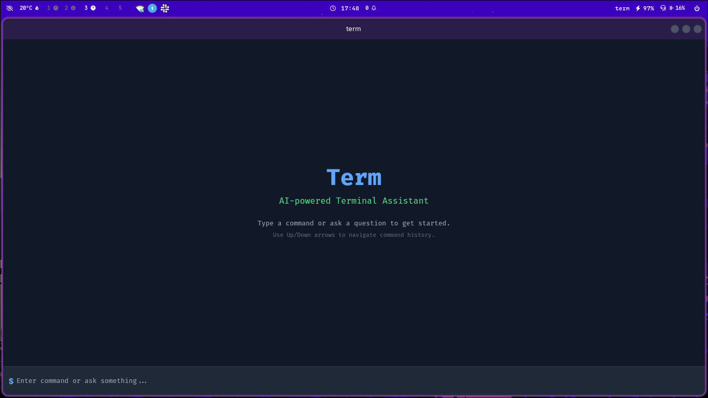
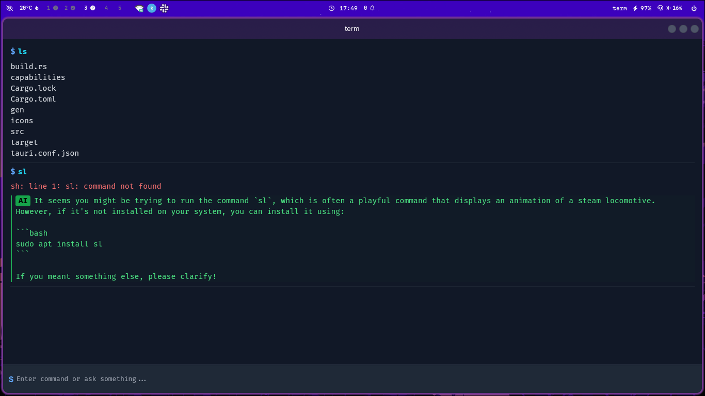

# Term - Minimal AI based terminal
A cross-platform terminal-like AI assistant with custom commands, local API key storage, and autocompletion support — built using **Tauri v2.5**, **React**, and **Rust**.

### Setup instructions
Please note I have tested it only on linux...


---

### 1. Clone the repository

```bash
git clone https://github.com/sapatevaibhav/term.git
cd term
```

### 2. Install system dependencies (for Arch Linux)

```bash
sudo pacman -S --needed base-devel webkit2gtk rsvg2
```
or choose the latest version as your OS
```bash
sudo apt update
sudo apt install build-essential libwebkit2gtk-4.1-dev  librsvg2-dev
```

### 3. Install Rust and Cargo

```bash
curl --proto '=https' --tlsv1.2 -sSf https://sh.rustup.rs | sh
source $HOME/.cargo/env
rustup default stable
```

### 4. Install Tauri CLI

```bash
cargo install create-tauri-app tauri-cli
```

### 5. Install Node.js dependencies

```bash
npm install  # or pnpm install
```

### 6. Run the app

```bash
npx tauri dev  # or npm run tauri dev
```

---

## 🔐 API Key Management

This terminal app securely stores your API key in a `.term` directory locally at the project root.

### First-time setup:

On first launch it will prompt to enter your OpenAI API key or set your API key using below step

### Set API key:

```shell
$setapikey sk-proj-xxxxxx

Validating API key...
API key validated and saved successfully!
```

### Reset API key:

```shell
$resetapikey
API key has been removed successfully.
You can set a new API key with the command: setapikey YOUR_API_KEY
```

---

## 💡 Sample Command Flow

There are some commands which are predefined in the file [autocomplete.ts](src/utils/autocomplete.ts) will be trigged by the shell itself if the input is not there inside those predefined commands then the AI will handle it.


For the issues and TODO refer [TODO File](TODO)

---






# React + TypeScript + Vite

This template provides a minimal setup to get React working in Vite with HMR and some ESLint rules.

Currently, two official plugins are available:

- [@vitejs/plugin-react](https://github.com/vitejs/vite-plugin-react/blob/main/packages/plugin-react) uses [Babel](https://babeljs.io/) for Fast Refresh
- [@vitejs/plugin-react-swc](https://github.com/vitejs/vite-plugin-react/blob/main/packages/plugin-react-swc) uses [SWC](https://swc.rs/) for Fast Refresh

## Expanding the ESLint configuration

If you are developing a production application, we recommend updating the configuration to enable type-aware lint rules:

```js
export default tseslint.config({
  extends: [
    // Remove ...tseslint.configs.recommended and replace with this
    ...tseslint.configs.recommendedTypeChecked,
    // Alternatively, use this for stricter rules
    ...tseslint.configs.strictTypeChecked,
    // Optionally, add this for stylistic rules
    ...tseslint.configs.stylisticTypeChecked,
  ],
  languageOptions: {
    // other options...
    parserOptions: {
      project: ['./tsconfig.node.json', './tsconfig.app.json'],
      tsconfigRootDir: import.meta.dirname,
    },
  },
})
```

You can also install [eslint-plugin-react-x](https://github.com/Rel1cx/eslint-react/tree/main/packages/plugins/eslint-plugin-react-x) and [eslint-plugin-react-dom](https://github.com/Rel1cx/eslint-react/tree/main/packages/plugins/eslint-plugin-react-dom) for React-specific lint rules:

```js
// eslint.config.js
import reactX from 'eslint-plugin-react-x'
import reactDom from 'eslint-plugin-react-dom'

export default tseslint.config({
  plugins: {
    // Add the react-x and react-dom plugins
    'react-x': reactX,
    'react-dom': reactDom,
  },
  rules: {
    // other rules...
    // Enable its recommended typescript rules
    ...reactX.configs['recommended-typescript'].rules,
    ...reactDom.configs.recommended.rules,
  },
})
```
